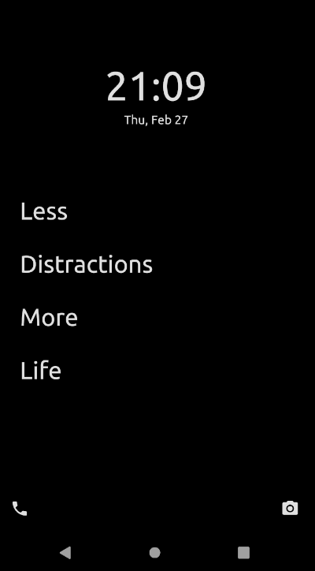
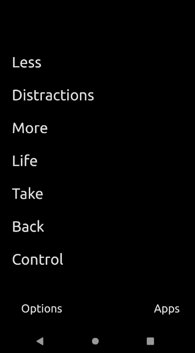

  

<h1 align="center">
  Unlauncher
</h1>

> _Freedom from your phone_

<!-- 
**Now available on Google Play and F-Droid!**

 -->

The goal of Unlauncher is to provide a clean and simple Android experience. We believe you should have easy access to all of your apps without the distraction of bells, whistles, and notifications clamouring for your attention. You want to be able to use your phone, not have your phone use you!

  
  

## About

Features:

- Top 8 spaces to pin apps
- No app icons
- Customizable app titles
- Searchable drawer with all apps
- Show/Hide the notification bar on your home screen
- No wallpapers
- Multiple color themes

## Project History

This project is a downstream fork of the great [Slim Launcher](https://github.com/sduduzog/slim-launcher) by [sduduzog](https://github.com/sduduzog). The contributors to that project deserve all the credit for the beautiful layout of this app and most of its functionality.

The main differentiator between Unlauncher and Slim Launcher lies in the number of apps the launcher gives you access too.  Slim Launcher takes the Spartan approach of only allowing access to seven apps. Unlauncher, on the other hand, allows you to pin eight apps to the home screen and then gives you access to all the rest of your apps through a new "Apps" button at the bottom of the home screen

The goal of this project is continue to remain synchronized, where possible, with Slim Launcher and to submit any new contributions back upstream (if they align with the design philosophy and goals of Slim Launcher).

## Communication

If you have any issues or questions, please log a [Github issue](https://github.com/jkuester/unlauncher/issues) for this repository.

## Contributing

Contributions are welcome! Simply open a pull request.

If a monetary contribution is more your style, please consider buying [sduduzog](https://github.com/sduduzog) (the author of the original project) a [cup of coffee](https://buymeacoff.ee/sduduzog).
